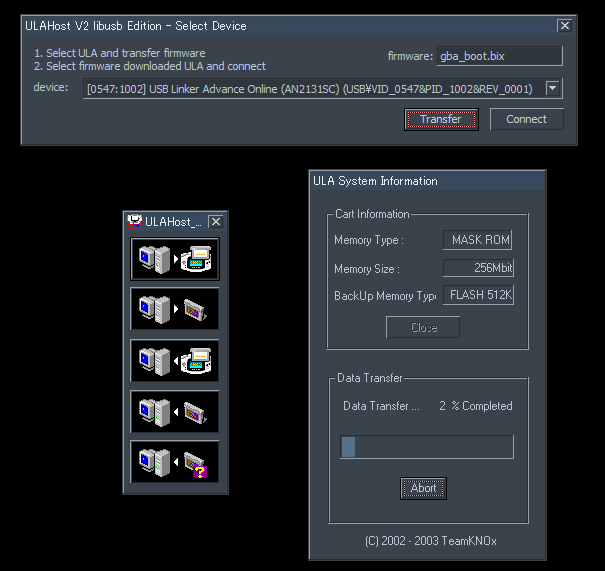

# ULAHostV2_with_ula_driver
ULAHostV2 with ula_driver_libusb mod

このプログラムは[TeamKNOx](http://www2.teamknox.com/)様が開発・公開されている[ULA-HostV2(build 20030731)](http://www2.teamknox.com/teamknox_old/ula/ula.html)のソースコードに、[RGBA_CRT](https://github.com/RGBA-CRT)が勝手に手を加えて[ula_driver_libusb](https://github.com/RGBA-CRT/ula_driver_libusb)に対応したものになります。

## additional feature
+ x64 Windowsへの対応
+ 転送するbixファイルの選択

その他機能はオリジナル版ULA-HostV2と同じはずです。

## how to use
1. (初回) Zadigを使ってULAにWinUSBドライバをインストールします。[参考](https://github.com/RGBA-CRT/ula_driver_libusb)
1. ULAHostV2.exeを起動します。デバイスの接続画面が現れます。
1. ULAデバイスを選択し、Transfarボタンでファームウェアを転送します。
   + (初回) ファーム転送後のULAにZadigを使ってWinUSBドライバをインストールします。
   + 以降、デバイスの電源が着れるまでこの手順はSkipできます。
1. ファーム転送後のULAを選択し、Connectボタンを押します。
1. あとは通常通りULA-HostV2を使用します。

# how to use ULA-GP
手動でFirmwareを転送することでULA-GPを使用する事ができます。

1. ULAHostV2を起動します。デバイスの接続画面が現れます。
1. ファーム転送後のULAを選択し、Connectボタンを押します。
1. Download ProgramでEWRAMへula_gp_gba.mb.gbaを転送します
1. ULAHostV2を終了し、再度ULAHostV2を起動します。
1. デバイス接続画面にula_gp.bixをD&Dします。
1. Transferボタンを押します。
1. ULA-GPが使用できるようになります

## thanks
ULAの開発とソースコードの公開、さらに本改変版の公開を快諾していただいた[TeamKNOx](http://www2.teamknox.com/)様にお礼申し上げます。

本ソフトウェアは[libusb](https://github.com/libusb/libusb)(LGPL)を使用しています。

----
Project url: https://github.com/RGBA-CRT/ULAHostV2_with_ula_driver
